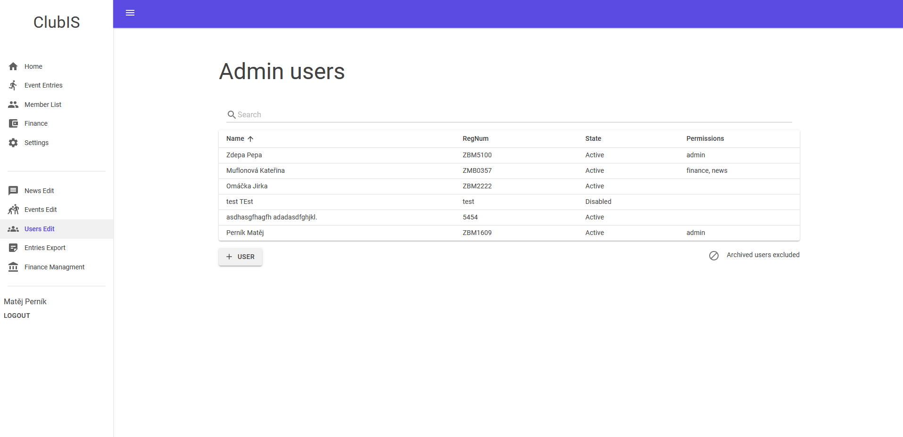

<!-- PROJECT SHIELDS -->
[![Stargazers][stars-shield]][stars-url]
[![Contributors][contributors-shield]][contributors-url]
[![Issues][issues-shield]][issues-url]
[![License][license-shield]][license-url]

# ClubIS
ClubIS is an information system for any Czech orienteering club. The core functionality includes management of Members data, Event entries and Finance. Tight integration with [Oris](https://oris.orientacnisporty.cz/) is planned to be implemented. The goal is to create a modern open-sourced and maintained information system to create an alternative for other outdated https://members.eob.cz/ or paid https://www.privatni-zona.cz/ solutions. I would be very grateful for any contribution, collaboration or feedback.

*The project is in an early stage of development and is not ready for production use!*

### To Do List
- [ ] Dev Wiki / Documentation
- [ ] Logging
- [ ] Mail remainders 
- [ ] Database backup / restore
- [ ] Oris integration
- [ ] Localization
- [ ] Tests
### Demo
Live demo is available at [clubis.hirot.eu](https://clubis.hirot.eu). Use the following credentials to log in.
| Login | Password | Note
| ------ | ------ | ----- |
| user123 | user123 | basic user
| admin123 | admin123 | full persmissions

### Preview
|  |  |
| ------ | ------ |
|  |  |

---
## Built With

 * [.NET 5](https://dotnet.microsoft.com/) | .NET Framework and .NET Core marged into multiplatform (Windows/Linux) .NET 5
 * [Blazor](https://dotnet.microsoft.com/apps/aspnet/web-apps/blazor) | component-based C# framework for creating web UI 
 * [MudBlazor](https://github.com/Garderoben/MudBlazor) | Material Design component framework for Blazor 

## Development
### Prerequisities
Before you begin, ensure you have installed the [.NET 5.0 SDK](https://dotnet.microsoft.com/download). 
### Database
For development purpose, an SQLite database is created and seeded with data on application start.  
For production, the PostgreSQL database server needs to be set up.  
Connection strings and database provider `{SQLite|PostgreSQL}` can be configured in [/WebAPI/appsettings.json](https://github.com/otahirs/ClubIS/blob/master/WebAPI/appsettings.json).
### Running
Using your favourite C# devolopment IDE, set `ClubIS.WebAPI` as your startup project and run the app.  
As an alternative, you can use `.NET CLI` and start the project by exucuting `dotnet run` in the `WebAPI` folder as the current directory.   
A web browser should be launched with the application running and fetching data from the API.  
Summary of the available API calls from the controllers will be at `http://localhost:{port}/swagger/index.html`, although most of the calls require you to log in to the application first in order to obtain the authorization cookie.

---
<!-- CONTRIBUTING -->
## Contributing

For feedback and any brilliant ideas for improvement (or even tiny little tweaks), feel free to open an issue or contact me at <otakar.hirs@gmail.com>.
Any contributions you make are **greatly appreciated**. For contributing directly:

1. Fork the Project
2. Create your Feature Branch (`git checkout -b feature/AmazingFeature`)
3. Commit your Changes (`git commit -m 'Add some AmazingFeature'`)
4. Push to the Branch (`git push origin feature/AmazingFeature`)
5. Open a Pull Request

I advise you, before opening a merge request, open related issue to discuss the upcoming changes first.

## Acknowledgements

Thanks to the following people who have contributed to this project:

* [@lopapex](https://github.com/lopapex) | student project collaborator
* [@mslachtova](https://github.com/mslachtova) | student project collaborator

---
<!-- LICENSE -->
## License

Distributed under the MIT License. See `LICENSE` for more information.

<!-- MARKDOWN LINKS & IMAGES -->
<!-- https://www.markdownguide.org/basic-syntax/#reference-style-links -->
[contributors-shield]: https://img.shields.io/github/contributors/otahirs/ClubIS?style=flat-square
[contributors-url]: https://github.com/otahirs/ClubIS/graphs/contributors
[stars-shield]: https://img.shields.io/github/stars/otahirs/ClubIS?style=flat-square
[stars-url]: https://github.com/otahirs/ClubIS/stargazers
[issues-shield]: https://img.shields.io/github/issues/otahirs/ClubISx?style=flat-square
[issues-url]: https://github.com/otahirs/ClubIS/issues
[license-shield]: https://img.shields.io/github/license/otahirs/ClubIS?style=flat-square
[license-url]: https://github.com/otahirs/ClubIS/blob/master/LICENSE

